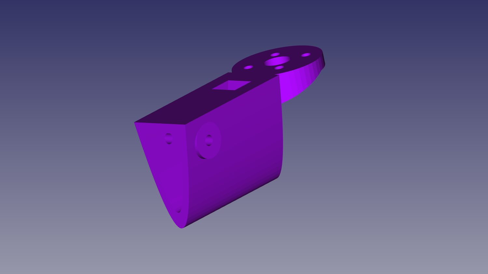
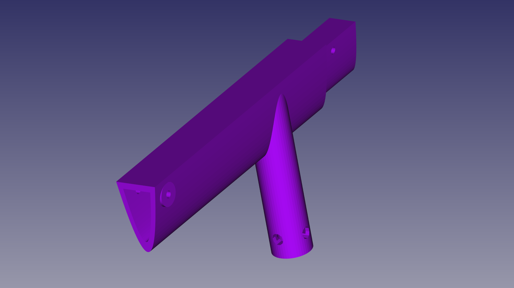
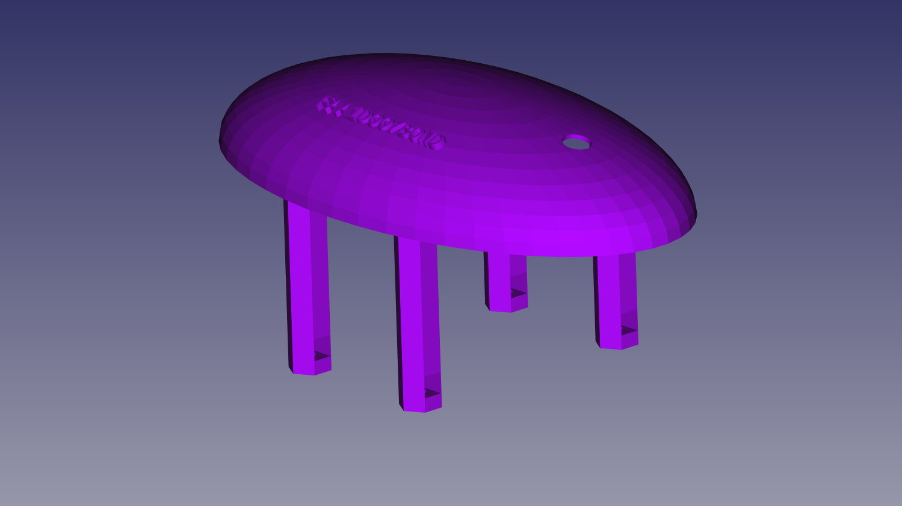
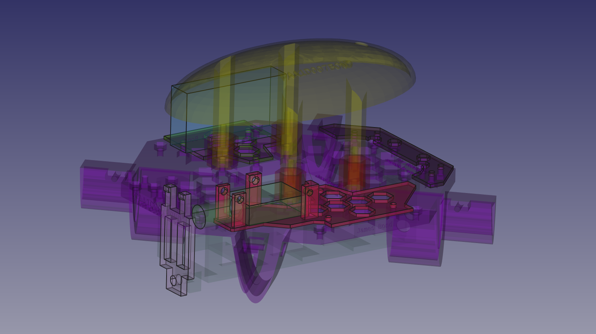

# XKE600 quadcopter notes

Updated 29 December 2020.

## Intro

This project is a 3D-printed "X" configuration quadcopter. An "X" configuration is one of the most common
configurations for ready-to-fly quad UAVs (drones) and basically has arms at 90 degree angles to each other
with powered propellers at the end of all 4. The direction of travel is at a 45-degree angle to each of the
two front arms.

The X stands for the configuration ("X") and 600 refers to the span in millimeters from the center of
one propeller to the center of the opposite propeller.

## Design

All design is in OpenSCAD with some of the accessories done in FreeCAD. Both are available for all
supported platforms (Linux, Windows and Mac). The basic airframe design philosophy is a compromise
between light weight, avoidance of sharp protuberances, reduced drag, relative robustness for rough
landings, and customization, including payloads such as an under-frame camera gimbal.

This was designed to be printed in PLA or PETG (with some parts in TPU), and held together using M3 
screws. Supporting both US and metric sizes was just not worth the trouble as M3 screw sets are 
readily available in the US through online retailers, and some M3 sizes are even available in the
parts drawers at home improvement chains like Lowe's and Home Depot.

The inverted parabolic arch design is meant to provide strength while relatively easy to print,
with hollow sections large enough for 18 gauge wires with 3.5mm bullet connectors (as are commonly
used on brushless motors and ESCs).

We've tried to adhere to a basic tenet of airframe design, which is to design for flying rather
than for crashing. The wall thickness of the parabolic sections was arrived at by iterative testing
by printing out a strut plus end section, then performing the "hammer test." The hammer test is
quite simple: use the strut, with an unusable motor attached to the end piece, as a hammer, with
the standoff (leg) on the strut striking concrete. If it didn't shatter immediately or suffer layer
separation, it was deemed adequate.

The strut legs are parameterized and can be made longer. They are not shock-absorbing, obviously,
but merely provide enough ground clearance for a small payload package such as a camera gimbal.

The central body has a large honeycomb pattern for weight reduction which should incidentally
allow some leeway for passing wiring components from top to bottom. It is basically an open
platform with a shell which does not cover it completely but should provide some protection
of the flight controller.

The unusual arrangement of spacers (which should be printed in TPU) which keep the GPS board
pressed against the inside of the shell serves two purposes:
1. Using TPU helps dampen motor vibration so the flight controller remains in a fixed position
   with vibrations reduced somewhat.
2. The GPS is kept separate from the ESCs with translucency for LEDs on the GPS board itself
   and also separate from metallic parts which may have become magnetized in contact with
   magnetic tools.

 The shell pillars are held in place by screws from the bottom with slot-type nut traps. While
 this makes assembly and disassembly somewhat awkward, it's not too onerous and connections on
 the flight controller are still accessible albeit tweezers may be needed. This modular design
 also is meant to make it somewhat easier to add slight variations in flight controller and
 GPS module size without requiring a reprint of the entire body.
 
 The GPS module is meant to be removed from whatever shell it may have come in. Hotglue may
 be useful for keeping the GPS module in place during assembly but may not be required.
 
## Comparison with other 3D-printed designs
 
 I found one other OpenSCAD-based project on Thingiverse which was appealling but didn't
 entirely suit my needs, so set out to design this. I had purchased a "carbon friber"
 X525 kit from someone in Shenzhen via ebay a few years ago, with black fiberglass parts
 for the center open frame, square aluminum tubing struts, and the need for a number of
 3D-printed parts. Once I put everything together it flew quite nicely but accessorization
 required more 3D printing, and I also prefer the X configuration over +.
 
## Hardware needed
 
 All of the screws listed are M3, and all nuts should be M3 nuts with nylon inserts. Anything
 subject to vibration should use nylon insert nuts as they are less prone to loosening. Alternatively
 there may be anti-loosening compounds that work but I would still not trust them to repeated 
 vibration over time. Nylon insert nuts have a higher profile than regular hex nuts, and all the
 nut traps in this design should be able to accommodate them.
 
* M3x30
* M3x12
* M3x10
* M3x8
 
## Flight components
 
 Many of these are still being evaluated. My original kit came with 1000kv motors, although 920kv
 may be more appropriate.
 
* 5000mAh 3S lipo battery (XT60 connectors seem to be the most popular nowadays)
* Power distribution board
* 4x 30A ESC (electronic speed controller)
* Radio unit and receiver with at least 6 channels (I have a Turnigy 9X but there are better ones 
 available for a similar price as of this writing, and for around USD $150 there are radios which
 support telemetry)
* Flight controller (I have a Pixhawk 1).
* Power adapter for flight controller and radio receiver
* Telemetry for base station and UAV, with antenna (optional - I have a 915mhz unit which operates
 at 5V rather than the 3.3V used by my flight controller, so it needs a $10 TTL level shifter
 board)
* GPS module (I have the discontinued 3DR uBlox-based module with a small rechargeable battery backup)
* 4x 1000kv brushless motors - the current design accommodates the 16x19 motor mount with screws going
 up directly through the printed end units - the X-shaped metal mount that usually comes with the motor
 is not needed.
* 2x CW and 2x CCW propellers. Currently using Gemfan 1045 (10 inch with 4.5 pitch). Note that the propeller
 span is determined by design although longer struts could accommodate larger props. Also the pitch and
 prop size need to be matched to the battery, ESC and motor combination, otherwise you could have poor
 responsiveness and/or flight times.
* Optional FPV
* Optional GoPro or similar camera
* Arm switch and buzzer for flight controller
 
## Printing parts
 
Most of the parts are already rendered and saved as STL files. You'll need these parts from assembly.scad

| Qty | Description			| Filename |
| --- | -----------			| -------- |
| 4x  | end assembly		| end-assembly.stl |
| 4x  | strut				| strut-assembly.stl |
| 4x  | upper spacers (TPU) | spacer-upper.stl |
| 4x  | lower spacers (TPU) | spacer-lower.stl |
| 1x  | pixhawk 			| pixhawk.stl |
| 1x  | pixhawk top			| pixhawk-top.stl |
| 1x  | shell (recommended light color filament for maximum translucency) | shell.stl |
| 1x  | battery holder		| battery-holder-5000.stl |
| 1x  | GPS holder			| gps.stl |
 
Note that the body can be customized with your FAA certificate number and identifying information.
These items can be entered in the Identifying info section of the OpenSCAD customizer.

Some accessory parts are in xke600-accessories.FCStd

| Qty | Description			| Filename |
| --- | -----------			| -------- |
| 1x  | battery retainer	| battery-retainer.stl |
| 1x  | left tray for receiver, PPM board, etc. | left-tray.stl |
| 1x  | front tray for power cable management | front-tray.stl |
| 1x  | right tray for buzzer, telemetry | right-tray.stl |
 
Print settings should generally be 50% infill, support touching print bed (required for body, struts and shell).
Brims recommended, particularly for PETG or using glass bed.

Slicing was done with Cura 4.8.

## Assembly

Holding the flight controller and GPS modules securely and vibration-free
is critical to smooth flight operations. See [this guide](https://docs.px4.io/v1.11/en/assembly/mount_and_orient_controller.html) for notes on orientation
and mounting of the Pixhawk flight controller. The Pixhawk (and the GPS unit, and nearly all
flight controller units) has an orientation mark indicating the direction of flight.

The assembly steps here are given for reference and while some of them must be done
in a particular sequence, this does not necessarily apply to the entire sequence.
Steps within each group skip to the next multiple of 10 to avoid renumbering
subsequent groups when new steps are added - there are no missing steps.

Group 1 - shell and controllers

1. Remove the GPS module from any plastic shell it may have come with. Do not connect it to the flight controller yet.
2. Put the GPS module in the GPS tray, noting that the orientation mark on the GPS module should correspond
   with the pointed end of the GPS tray. The cables should exit from the flat end as shown.
3. Ensure that the GPS module fits snugly within the tray with no wiggling from side to side.
   It must be perfectly flat. The top of the module should protrude above the walls of the tray
   by about 0.5mm. This will come in contact with the inside bottom of the shell.
4. Slide the GPS module onto the legs of the shell, with the front (pointed end) of the 
   tray matching the orientation of the GPS module and the shell. The shell has a direction
   arrow on top, and a hole for the arm switch in the back.
5. Slide 4 of the smaller upper spacers onto the shell legs.
6. All wires for the Pixhawk top need to go through the Pixhawk top retainer piece. They can
   be connected at this time.
7. Slide the Pixhawk top onto the shell legs, noting the orientation (indicated by an arrow
   on the bottom of the top piece).
8. Place the Pixhawk in the base piece, ensuring that it fits snugly with no wiggle. Note the direction 
   of the orientation arrow on the Pixhawk, which may be in the opposite direction from any lettering.
   Most wires will exit to the rear or on the top.
9. Slide the Pixhawk with the base assembly onto the shell legs, noting the orientation of the
   Pixhawk matches that of the shell.
10. Insert locking M3 nuts into the slots near the base of the shell legs. It may help to insert an
    M3 screw into the bottom to ensure the nuts are seated properly.
11. Slide the longer lower spacers onto the shell legs.
12. Slide the flexible power distribution board cover onto the shell legs. Some compression may be required.
    This step may have to be completed as part of securing the shell to the base.

Group 2 - power distribution and base

20. Secure the power distribution board to the base with 4 M3x8 screws with locking nuts. Most of the
    power connections should come out on the bottom.
21. Secure the shell and controllers assembly to the base with 4 M3x12 screws using the locking nuts
    previously inserted in the shell legs. Ensure that wires exit as expected and are not trapped under
	the legs before tightening the screws.
22. Secure the battery holder to the base with 4 M3x10 screws with locking nuts.

	

